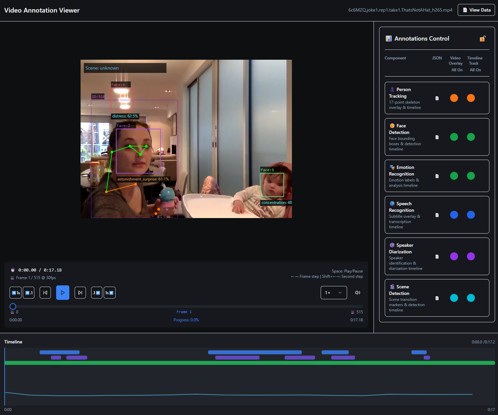

# VideoAnnotator

[](https://github.com/InfantLab/VideoAnnotator/actions/workflows/ci-cd.yml)
[](LICENSE)
[](https://www.python.org/downloads/)
[](https://doi.org/10.5281/zenodo.16961751)

**Automatic annotation of videos of people, for behavioural research.** VideoAnnotator finds the
people, faces, speech and scenes in your videos, writes the results in standard formats, and shows
them on the video so you can check them. Everything runs on your own computer: your videos are never
uploaded anywhere.

It was built for studies of parent–child interaction, and suits any research that codes behaviour
from video: developmental psychology, clinical observation, classroom and human–computer
interaction studies.



## What it does

You choose videos and pipelines in the browser; VideoAnnotator runs them and keeps the results.

| Pipeline | What you get | File format |
|---|---|---|
| Person tracking | Each person's box and 17-point pose, with an ID that follows them | COCO |
| Face analysis | Faces with emotion, age and gender estimates | COCO |
| Face embeddings (OpenFace 3) | A 512-number description of each face, for telling people apart | JSON |
| Scene detection | Where the scene cuts, and what kind of place each scene is | JSON |
| Speech recognition | A transcript with word timings (Whisper) | WebVTT |
| Speaker diarization | Who spoke when (pyannote) | RTTM |
| VLM annotation | Your own question, asked of video frames by a local vision-language model (Ollama) | JSON |

The viewer then lets you:

- Play the video with every result drawn on it, and a timeline of speech, speakers and scenes.
- Run the same settings again, or change one and compare the results.
- Keep named lists of videos (datasets) to run studies on.
- Write and test prompts for the VLM pipeline, and compare two models' labels against your own
  coding (ELAN `.eaf`).

Every output file records what made it: the pipeline and VideoAnnotator version, the model and its
exact weights, and the settings. That is what you need to report the method, and to get the same
results again later.

## Install

VideoAnnotator itself needs about 1 GB of disk. Each pipeline adds its libraries and models:
allow about 12 GB if you install every one. A job running every pipeline used about 6 GB of
memory, so 16 GB of RAM is comfortable. A GPU is optional.

### Windows

In PowerShell:

```powershell
# 1. Tools: uv (Python manager), Git, ffmpeg
winget install astral-sh.uv Git.Git Gyan.FFmpeg
# (close and reopen PowerShell so it finds them)

# 2. VideoAnnotator
git clone https://github.com/InfantLab/VideoAnnotator.git
cd VideoAnnotator
uv sync

# 3. Start it
uv run videoannotator server
```

On Windows the pipelines run on the CPU. To use an NVIDIA GPU, run the [Docker image](docs/deployment/Docker.md) instead.

### macOS

In Terminal (with [Homebrew](https://brew.sh)):

```bash
# 1. Tools
brew install uv git ffmpeg libomp

# 2. VideoAnnotator
git clone https://github.com/InfantLab/VideoAnnotator.git
cd VideoAnnotator
uv sync

# 3. Start it
uv run videoannotator server
```

Apple Silicon and Intel Macs run the pipelines on the CPU.

### Linux

```bash
# 1. Tools (Debian/Ubuntu; use your distribution's package manager otherwise)
sudo apt install git ffmpeg
curl -LsSf https://astral.sh/uv/install.sh | sh

# 2. VideoAnnotator
git clone https://github.com/InfantLab/VideoAnnotator.git
cd VideoAnnotator
uv sync

# 3. Start it
uv run videoannotator server
```

With an NVIDIA GPU (driver 560 or newer), the pipelines use it automatically.

## Open the viewer

The first time the server starts, it prints a link:

```
Connect the viewer with one click:
  http://127.0.0.1:18011/viewer-connect?token=...
```

Open it in your browser. It logs you in and opens the viewer's home page. From there:

1. **New job**: choose one or more videos and the pipelines to run. The first time you choose a
   pipeline, the viewer offers to install it. Restart the server when it asks you to.
2. **Jobs**: follow progress. A job takes from about a minute (a short clip) to longer than the
   video itself (all pipelines, on a CPU).
3. **View** a finished job to see the results on the video, and download the files.

Lost the link? `uv run videoannotator generate-token` makes a new one.

Speaker diarization needs a free Hugging Face token
([how to get one](docs/installation/ENVIRONMENT_SETUP.md)). The VLM pipeline needs
[Ollama](https://ollama.com) running on the same computer.

## Learn more

- **[Documentation](docs/README.md)**: install options, every pipeline, output formats,
  configuration and troubleshooting.
- **[Getting started](docs/usage/GETTING_STARTED.md)**: a first job, step by step.
- **[Command line and API](docs/usage/demo_commands.md)**: everything the viewer does can also be
  scripted, via `videoannotator` commands or the REST API (documented at
  http://127.0.0.1:18011/docs while the server runs).
- **[Docker](docs/deployment/Docker.md)**: run it in a container, with or without a GPU.
- **[Changelog](CHANGELOG.md)**: what changed in each release.

## Citing VideoAnnotator

If you use VideoAnnotator in your research, please cite it (GitHub's "Cite this repository" gives
the details from [CITATION.cff](CITATION.cff)):

```
Addyman, C. (2025). VideoAnnotator: Automated video analysis toolkit for human interaction research.
Zenodo. https://doi.org/10.5281/zenodo.16961751
```

Please also cite the models behind the pipelines you used; each output file names them.

## Contributing and contact

- Report a problem or ask for a feature: [GitHub Issues](https://github.com/InfantLab/VideoAnnotator/issues)
- Questions and ideas: [GitHub Discussions](https://github.com/InfantLab/VideoAnnotator/discussions)
- Contributing code: [CONTRIBUTING.md](CONTRIBUTING.md)
- Research collaborations: Caspar Addyman, infantologist@gmail.com

## Team

- **Caspar Addyman**, Stellenbosch University, South Africa ([ORCID](https://orcid.org/0000-0003-0001-9548)): lead developer and corresponding author
- **Jeremiah Ishaya**, Stellenbosch University, South Africa ([ORCID](https://orcid.org/0000-0002-9014-9372))
- **Irene Uwerikowe**, Stellenbosch University, South Africa ([ORCID](https://orcid.org/0000-0002-1293-7349))
- **Daniel Stamate**, Department of Computing, Goldsmiths, University of London, UK ([ORCID](https://orcid.org/0000-0001-8565-6890))
- **Jamie Lachman**, Department of Social Policy and Intervention, University of Oxford, UK ([ORCID](https://orcid.org/0000-0001-9475-9218))
- **Mark Tomlinson**, Stellenbosch University, South Africa ([ORCID](https://orcid.org/0000-0001-5846-3444))

Funded by **The Global Parenting Initiative** (The LEGO Foundation).

## Acknowledgements

VideoAnnotator stands on these open-source projects:
[Ultralytics YOLO](https://ultralytics.com/) (people and pose),
[DeepFace](https://github.com/serengil/deepface) (faces and emotion),
[OpenFace 3.0](https://github.com/CMU-MultiComp-Lab/OpenFace-3.0) (face embeddings),
[PySceneDetect](https://www.scenedetect.com/) and [OpenCLIP](https://github.com/mlfoundations/open_clip)
with weights trained on [LAION](https://laion.ai/)-2B (scenes),
[OpenAI Whisper](https://github.com/openai/whisper) (speech),
[pyannote.audio](https://github.com/pyannote/pyannote-audio) (speakers),
[Ollama](https://ollama.com) (vision-language models),
[PyTorch](https://pytorch.org/) and [FastAPI](https://fastapi.tiangolo.com/).

Development was helped by [Visual Studio Code](https://code.visualstudio.com/),
[GitHub Copilot](https://github.com/features/copilot) and [Claude Code](https://claude.ai/code).

Released under the [MIT License](LICENSE).
