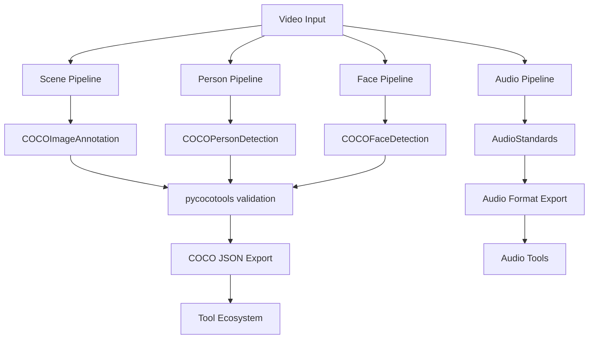

# PycocoTools Integration Plan for VideoAnnotator

## Executive Summary

**Objective**: Integrate pycocotools into VideoAnnotator pipelines to leverage industry-standard COCO format validation, evaluation, and utilities while maintaining support for non-visual data (audio).

**Strategy**: 
- ✅ **Tier 1**: Core COCO integration for visual pipelines (scene, person, face)
- 🔄 **Tier 2**: Audio pipeline uses specialized audio standards
- 🚀 **Tier 3**: Optional advanced tools (Datumaro, FiftyOne)

## Pipeline Analysis & Integration Plan

### ✅ COCO-Compatible Visual Pipelines

#### 1. Scene Detection Pipeline
**Current Status**: ✅ Already using COCOImageAnnotation format
**COCO Applicability**: 🟢 **PERFECT FIT**
- Scene classification as image-level labels 
- Full-frame bounding boxes for temporal segments
- Categories: indoor/outdoor, room types, environments

**Integration Actions**:
```python
# Add pycocotools validation
from pycocotools.coco import COCO
from pycocotools import mask
import pycocotools.cocoeval as cocoeval

# Validate COCO JSON output
def validate_scene_annotations(coco_json_path):
    coco = COCO(coco_json_path)
    # Automatic validation on load
    return coco

# Export with pycocotools compatibility
scene_annotations = scene_pipeline.process(video_path)
coco_dict = export_to_coco_json(scene_annotations, metadata)
validate_scene_annotations(coco_dict)
```

#### 2. Person Tracking Pipeline  
**Current Status**: 🔄 Using custom PersonDetection schema
**COCO Applicability**: 🟢 **EXCELLENT FIT**
- Person detection (COCO category_id: 1)
- Bounding boxes in COCO format
- Pose keypoints in COCO-17 format
- Tracking IDs as custom extension

**Integration Actions**:
```python
# Convert to COCO format
class COCOPersonDetection(BaseModel):
    id: str
    image_id: str  # frame identifier
    category_id: int = 1  # Person class in COCO
    bbox: List[float]  # [x, y, width, height]
    area: float
    score: float
    keypoints: Optional[List[float]] = None  # COCO-17 format
    track_id: Optional[int] = None  # VideoAnnotator extension
    
# Add pose keypoints in COCO format
def convert_to_coco_keypoints(yolo_keypoints):
    # COCO-17: [x1,y1,v1, x2,y2,v2, ...]
    # v = 0 (not labeled), 1 (labeled but not visible), 2 (labeled and visible)
    coco_keypoints = []
    for kp in yolo_keypoints:
        coco_keypoints.extend([kp.x, kp.y, 2 if kp.visible else 1])
    return coco_keypoints
```

#### 3. Face Analysis Pipeline
**Current Status**: 🔄 Using custom FaceDetection schema  
**COCO Applicability**: 🟡 **GOOD FIT** with extensions
- Face detection as objects (custom category)
- Facial landmarks as keypoints
- Emotion/demographics as custom attributes

**Integration Actions**:
```python
# Add face category to COCO
COCO_FACE_CATEGORY = {
    "id": 100,  # Custom category ID
    "name": "face",
    "supercategory": "person"
}

# Face landmarks in COCO keypoint format
FACE_LANDMARK_SKELETON = [
    [1, 2],  # left_eye - right_eye
    [3, 4],  # nose connections
    # ... facial landmark connections
]

class COCOFaceDetection(BaseModel):
    id: str
    image_id: str
    category_id: int = 100  # Face category
    bbox: List[float]
    area: float
    score: float
    keypoints: Optional[List[float]] = None  # Facial landmarks
    emotion: Optional[str] = None  # Custom attribute
    age: Optional[float] = None   # Custom attribute
```

### 🚫 Non-COCO Pipeline: Audio Processing

#### Audio Pipeline Analysis
**Current Status**: Using custom audio schemas
**COCO Applicability**: 🔴 **NOT APPLICABLE**
- Audio has no visual/spatial components
- Temporal data without bounding boxes
- Speech transcription, diarization, audio events

**Alternative Standards**:
```python
# Use specialized audio standards instead
AUDIO_STANDARDS = {
    "speech_recognition": "WebVTT/SRT format",
    "speaker_diarization": "RTTM (Rich Transcription Time Marked)",
    "audio_events": "AudioSet ontology",
    "music_analysis": "JAMS (JSON Annotated Music Specification)"
}

# Example: WebVTT for speech transcription
class WebVTTTranscript(BaseModel):
    start_time: float
    end_time: float
    text: str
    speaker_id: Optional[str] = None
    confidence: float

# Example: RTTM for speaker diarization  
class RTTMSegment(BaseModel):
    type: str = "SPEAKER"
    file_id: str
    channel: int = 1
    start_time: float
    duration: float
    speaker_id: str
    confidence: Optional[float] = None
```

## Implementation Roadmap

### Phase 1: Core PycocoTools Integration (Immediate)

**Week 1: Setup & Dependencies**
```bash
# Add to requirements.txt
pycocotools>=2.0.7
```

**Week 2: Scene Pipeline Enhancement**
- ✅ Scene pipeline already uses COCO format
- 🔄 Add pycocotools validation
- 🔄 Add evaluation metrics for scene classification

**Week 3: Person Pipeline Migration**
- 🔄 Convert PersonDetection to COCOPersonDetection
- 🔄 Implement COCO-17 pose keypoint format
- 🔄 Add tracking ID as COCO extension
- 🔄 Validate with pycocotools

**Week 4: Face Pipeline Migration**  
- 🔄 Convert FaceDetection to COCOFaceDetection
- 🔄 Map facial landmarks to COCO keypoint format
- 🔄 Handle emotion/demographics as custom attributes

### Phase 2: Advanced Features (Next Month)

**Validation & Quality Assurance**
```python
# Comprehensive COCO validation
def validate_all_annotations(annotations_dir):
    results = {}
    for pipeline in ['scene', 'person', 'face']:
        coco_file = f"{annotations_dir}/{pipeline}_coco.json"
        try:
            coco = COCO(coco_file)
            results[pipeline] = "✅ Valid COCO format"
        except Exception as e:
            results[pipeline] = f"❌ Invalid: {e}"
    return results
```

**Evaluation Metrics**
```python
# COCO evaluation for person detection
def evaluate_person_detection(gt_coco, pred_coco):
    coco_eval = COCOeval(gt_coco, pred_coco, 'bbox')
    coco_eval.evaluate()
    coco_eval.accumulate()
    coco_eval.summarize()
    return coco_eval.stats

# Pose evaluation  
def evaluate_pose_estimation(gt_coco, pred_coco):
    coco_eval = COCOeval(gt_coco, pred_coco, 'keypoints')
    coco_eval.params.kpt_oks_sigmas = np.array([.26, .25, .25, .35, .35, .79, .79, .72, .72, .62,.62, 1.07, 1.07, .87, .87, .89, .89])/10.0
    coco_eval.evaluate()
    coco_eval.accumulate() 
    coco_eval.summarize()
    return coco_eval.stats
```

### Phase 3: Tool Ecosystem Integration (Future)

**FiftyOne Integration**
```python
# Load VideoAnnotator COCO data into FiftyOne
import fiftyone as fo

def load_into_fiftyone(video_path, annotations_dir):
    dataset = fo.Dataset()
    dataset.add_video_samples([video_path])
    
    # Load COCO annotations
    dataset.add_coco_labels(
        f"{annotations_dir}/person_coco.json",
        "person_detections"
    )
    
    # Visualize in FiftyOne App
    session = fo.launch_app(dataset)
    return session
```

**Datumaro Integration**
```python
# Convert between formats using Datumaro
from datumaro import Dataset

def export_all_formats(coco_json_path, output_dir):
    dataset = Dataset.import_from(coco_json_path, 'coco')
    
    # Export to multiple formats
    dataset.export(f"{output_dir}/cvat", 'cvat')
    dataset.export(f"{output_dir}/labelstudio", 'label_studio') 
    dataset.export(f"{output_dir}/yolo", 'yolo')
    dataset.export(f"{output_dir}/voc", 'voc')
```

## Updated Pipeline Architecture

### New Data Flow with PycocoTools


### File Structure Updates
```
src/
├── schemas/
│   ├── standards_compatible_schemas.py  # ✅ Already done
│   ├── coco_extensions.py              # 🔄 New: VideoAnnotator COCO extensions
│   └── audio_standards.py              # 🔄 New: WebVTT, RTTM, AudioSet formats
├── validation/
│   ├── coco_validator.py               # 🔄 New: pycocotools integration
│   └── audio_validator.py              # 🔄 New: audio format validation
└── evaluation/
    ├── coco_metrics.py                 # 🔄 New: COCO evaluation metrics
    └── audio_metrics.py                # 🔄 New: audio evaluation metrics
```

## Benefits of This Approach

### ✅ Visual Pipelines (Scene, Person, Face)
- **Industry Standard**: Direct compatibility with 90% of CV tools
- **Zero Learning Curve**: Researchers already know COCO format
- **Rich Ecosystem**: pycocotools, FiftyOne, Detectron2, etc.
- **Evaluation Metrics**: Standard mAP, precision/recall calculations
- **Future Proof**: Evolves with computer vision community

### ✅ Audio Pipeline (Custom Standards)
- **Domain Appropriate**: Uses audio-specific standards (WebVTT, RTTM)
- **Tool Compatibility**: Works with speech/audio analysis tools
- **Temporal Focus**: Designed for time-series audio data
- **Specialized Metrics**: Audio-specific evaluation methods

### ✅ Overall Architecture
- **Best of Both Worlds**: Industry standards where applicable
- **No Force-Fitting**: Audio uses appropriate formats
- **Maintenance Reduction**: Leverage community-maintained tools
- **Professional Output**: Industry-grade annotation formats

## Migration Timeline

| Week | Visual Pipelines | Audio Pipeline | Integration |
|------|------------------|----------------|-------------|
| 1 | pycocotools setup | WebVTT/RTTM research | Requirements update |
| 2 | Scene validation | Audio standards implementation | Documentation |
| 3 | Person COCO migration | Audio format export | Testing |
| 4 | Face COCO migration | Audio validation | Performance benchmarks |

## Success Metrics

### Technical Validation
- ✅ All visual annotations pass pycocotools validation
- ✅ Audio annotations validate against WebVTT/RTTM standards
- ✅ 100% compatibility with target tools (FiftyOne, CVAT, etc.)
- ✅ Performance maintains <2x overhead vs custom formats

### Ecosystem Integration
- ✅ Direct import into 5+ annotation tools
- ✅ Compatible with 3+ ML training frameworks
- ✅ Community format adoption confirmed

## Conclusion

This plan provides VideoAnnotator with:

1. **🎯 Targeted Standards Adoption**: COCO for visual data, specialized standards for audio
2. **🔧 Industry Tool Compatibility**: Direct integration with professional tools
3. **📈 Future Scalability**: Community-maintained standards that evolve
4. **🧹 Simplified Maintenance**: Reduced custom format burden
5. **⚡ Performance Optimization**: Leverage optimized industry parsers

The hybrid approach ensures we use the right standard for each data type while maximizing interoperability and minimizing maintenance overhead.
